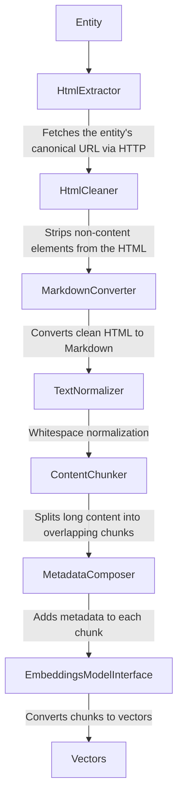

# Helfi Search

Drupal module that converts content entities into vector embeddings for semantic search. Integrates with Search API and Elasticsearch.

## Text Pipeline

The text pipeline converts Drupal entities into embedding-ready text. It is orchestrated by `TextPipeline::process()`, which passes each entity through six stages:



## Configuration

`deboost_bundles`, `deboost_factor`, and `min_score` are added to `config_ignore` by `ConfigIgnoreHook`, so they can be tuned on a running site.

| Key               | Type            | Description                                                                                                                                                                |
|-------------------|-----------------|----------------------------------------------------------------------------------------------------------------------------------------------------------------------------|
| `deboost_bundles` | list of strings | Entity bundles whose KNN scores are multiplied by `deboost_factor` so they rank lower.                                                                                     |
| `deboost_factor`  | float (0.0–1.0) | Multiplier applied to de-boosted bundle scores. `1.0` disables the effect; `0.5` halves KNN scores.                                                                        |
| `min_score`       | float (0.0–1.0) | Minimum similarity floor. Hits below this threshold are dropped. Raw cosine similarity = `min_score * 2 - 1`, so `0.85` corresponds to a document `_score` of about `0.7`. |
| `ignored_classes` | list of strings | CSS classes whose elements `HtmlCleaner` strips before Markdown conversion.                                                                                                |

Set value with drush:

```sh
drush config:set helfi_search.settings min_score 0.7
drush config:set helfi_search.settings deboost_factor 0.85
drush config:set --input-format=yaml helfi_search.settings ignored_classes '[is-hidden, visually-hidden, new-class]'
drush config:set --input-format=yaml helfi_search.settings deboost_bundles '[news_article, news_item, some_bundle]'
```
